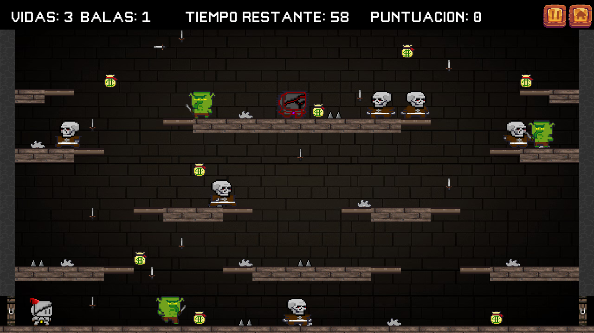
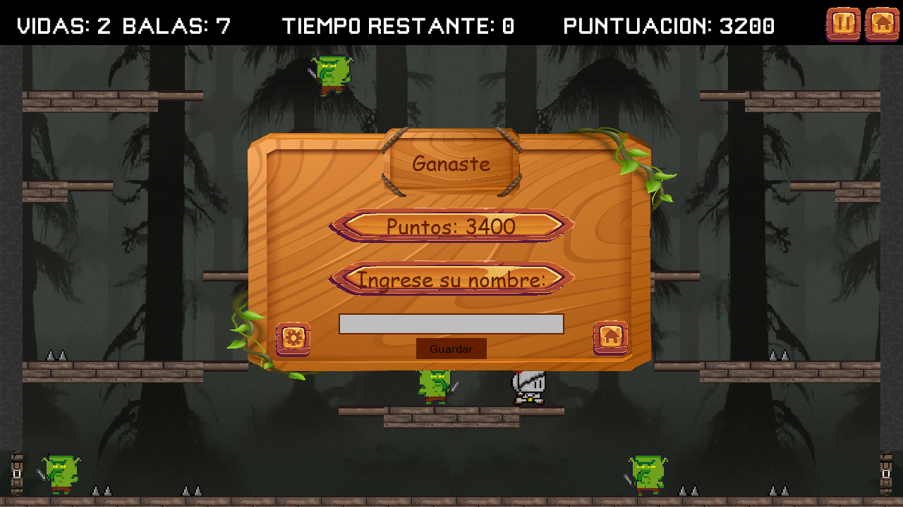

# Juego python - El caballero la venganza final - SP LAB_I

Este es el juego que desarrolle para el parcial numero 2 de la materia Laboratorio 1 de la tecnicatura universitaria en programación (UTNFRA) - "El caballero y la venganza final"

## Resumen:
Mi aplicación narra la historia de un valiente caballero que se aventura en una mazmorra en busca de venganza. El malévolo Caballero Oscuro le ha despojado de la riqueza acumulada a lo largo de generaciones, y nuestro protagonista está decidido a recuperar lo que legítimamente le pertenece. Antes de llegar al primer nivel de la mazmorra, se enfrenta a duendes que resguardan la entrada. En el segundo nivel, se encuentra con esqueletos que protegen el acceso a la habitación donde aguarda el temible jefe final. Para superar el último nivel, el valiente caballero debe enfrentarse al Caballero Final, con la esperanza de encontrar la liberación para su atribulada mente.

Cada tipo de enemigo posee habilidades únicas: los duendes atacan cuerpo a cuerpo, los esqueletos utilizan espadas a distancia, y el jefe final se enfrenta en combate cuerpo a cuerpo, protegido por su propia armadura y casco. A lo largo del juego, el protagonista descubre espadas dispersas en el mapa que puede utilizar para atacar a sus adversarios, así como bolsas de dinero que le permiten recuperar parte de la fortuna que le fue arrebatada.

## Vista y uso del juego:

### Menu Principal: 

1. *Menu Principal*: Aquí encontrarás la opción "Play" para comenzar a jugar y acceder a la selección de niveles. También puedes explorar "Settings" para configurar el juego, revisar "Credits" para conocer al desarrollador. En las esquina inferior izquierda hay un botón para acceder a las instrucciones y a la derecha para acceder al ranking para ver los mejores puntajes.
### Instrucciones: 

2. *Instrucciones*: Proporciona una guía clara sobre los controles del juego. Utiliza las teclas W para saltar, A y D para moverte a la izquierda y derecha, y E para disparar. El botón Home te permite regresar al menú anterior.
### Ranking: 

3. *Ranking*: Conectado a una base de datos, muestra los tres mejores puntajes para cada uno de los tres niveles del juego. Puedes regresar al menú principal con el botón Home.
### Settings: 

4. *Settings*: Ajusta el volumen de los efectos de sonido y la música, y silencia el sonido según tus preferencias. El botón Home te lleva de nuevo al menú principal.
### Credits: 

5. *Credits*: Revela el nombre del desarrollador del juego.
### Play: 

6. *Play*: Al hacer clic en "Play", accederás a la selección de niveles, desde el nivel 1 hasta el nivel 3. Debes ganar cada nivel para desbloquear el siguiente.
### Nivel Uno: 

7. *Nivel Uno*: Nivel compuesto por duendes (ataques cuerpo a cuerpo), trampas (pinchos), objetos recogibles (monedas y espadas), el nivel se termina al completarse el tiempo, el objetivo es conseguir la máxima puntuación posible sin morir, para esto hay 3 vidas, cuando queda 1 automáticamente apareceran cajas por el mapa que contienen un cáliz de vino que ayudará para la regeneración. 
### Nivel Dos: 

8. *Nivel Dos*: Nivel compuesto por esqueletos (ataques a distancia), trampas (pinchos), objetos recogibles (monedas y espadas), el nivel se termina al completarse el tiempo, el objetivo es conseguir la máxima puntuación posible sin morir, para esto hay 3 vidas, cuando queda 1 automáticamente apareceran cajas por el mapa que contienen un cáliz de vino que ayudará para la regeneración. 
### Nivel Tres: 

9. *Nivel Tres*: Nivel compuesto por los enemigos anteriores sumado al boss final - Caballero oscuro (ataques cuerpo a cuerpo, casco y armadura). El objetivo es matarlo, intentando conseguir el máximo de puntuación en el intento, si acaba el tiempo pierdes al igual que si tus vidas llegan a 0.
### Pausa: 

10. *Pausa*: Puedes pausar y reanudar el juego en cualquier momento. Además, accede a la configuración para ajustar el volumen.
### Menu Game Over: 

10. *Menu Game Over*: Después de ganar, introduce tu nombre para registrar tu puntuación en la base de datos. Si pierdes, puedes intentarlo de nuevo o regresar al menú principal.

> Nota: Al querer instalar el ejecutable puede generar inconvenientes, ante cualquier error revise su antivirus.
